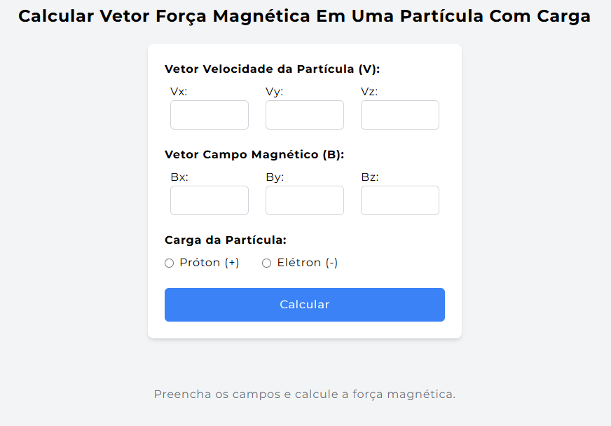
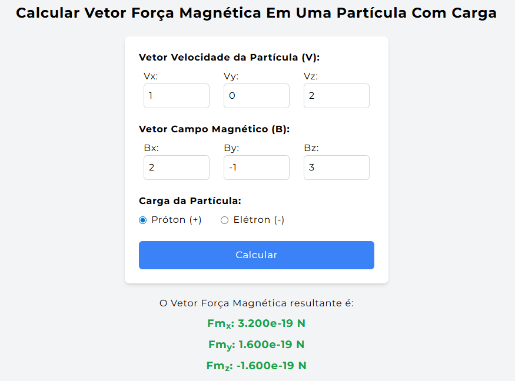

# Calculate Magnetic Force Vector - React + FastAPI + Plotly

This project calculates the magnetic force acting on a charged particle, given the velocity vector and the magnetic field vector.  
The application displays the numerical result and shows a 3D interactive graph of the resulting magnetic force vector, with an arrow starting from the origin and a sphere representing the particle.

---

## 🌍 Read in another language
- 🇧🇷 [Portuguese-BR](README.pt.md)

---

## ⚙️ Technologies Used

- **Frontend:** React (with Vite, TailwindCSS)
- **Backend:** FastAPI (Python)
- **3D Visualization:** Plotly (Python)
- **Communication:** HTTP POST with JSON

---

## 🗂️ Project Structure

```txt
/frontend   # React application
/backend    # FastAPI + Plotly API for generating the plot
```

---

## 🚀 How to Run Locally

### ✅ Prerequisites

- Node.js (v16 or newer)
- Python 3.8 or newer
- `pip` (Python package manager)

---

### 🔧 Step 1: Run the Backend (FastAPI)

1. Open a terminal and navigate to the `/backend` folder
2. Create and activate a virtual environment (recommended):

```bash
python -m venv venv
# Linux/macOS:
source venv/bin/activate
# Windows PowerShell:
.\venv\Scripts\activate
```

3. Install the dependencies:

```bash
pip install -r requirements.txt
```

4. Still inside the `backend` folder, run the server:

```bash
uvicorn main:app --reload
```

5. You should see a message like the following:
```bash
Uvicorn running on http://localhost:8000
```

6. Add the allowed frontend address in `/backend/main.py`:

```python
app.add_middleware(
    CORSMiddleware,
    allow_origins=["http://localhost:8000"], # Address provided by the `npm run dev` command
    allow_credentials=True,
    allow_methods=["*"],
    allow_headers=["*"],
)
```

---

### 🧪 Step 2: Run the Frontend (React)

1. In another terminal, go to the `/eletromag-fios` folder:

```bash
cd eletromag-fios
```

2. Install the dependencies:

```bash
npm install
```

3. Set the API URL in `App.jsx`:

```js
fetch("http://localhost:8000/plotar", { // Address provided by the `uvicorn main:app --reload` command
  method: "POST",
  headers: { "Content-Type": "application/json" },
  body: JSON.stringify({ Fm }),
})
```

4. Start the application:

```bash
npm run dev
```

5. Open your browser and visit the address provided (example):

```bash
http://localhost:8001
```

---

## 🧠 How to Use

1. Fill in the vector fields with numeric values:
   - Particle velocity (`Vx`, `Vy`, `Vz`)
   - Magnetic field (`Bx`, `By`, `Bz`)
2. Select the particle's charge: **proton** or **electron**

   

3. Click the **"Calculate"** button
4. The numerical result of the magnetic force will be displayed

   

5. A 3D graph will be generated in another tab showing:
   - The **arrow** representing the magnetic force vector
   - A **sphere** at the origin representing the particle

   

---

## 📄 License

This project is licensed under the terms of the **MIT License**.
