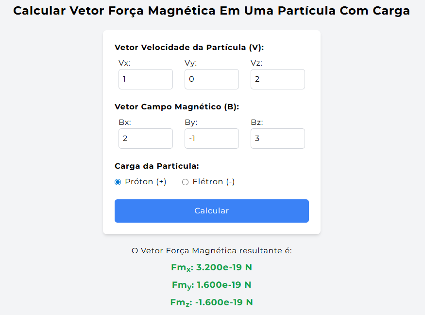
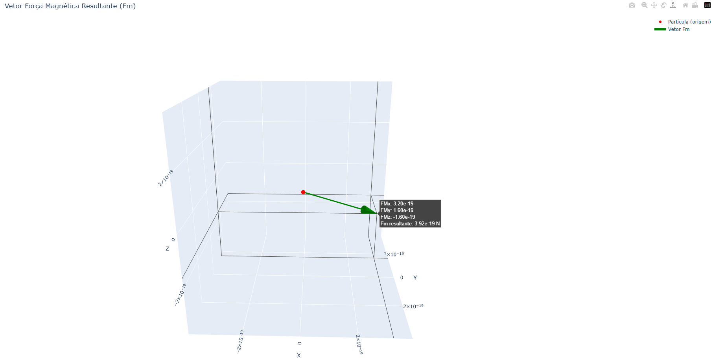

# Calcular Vetor Força Magnética - React + FastAPI + Plotly

Este projeto permite calcular a força magnética sobre uma partícula carregada, dado o vetor velocidade e o vetor campo magnético.  
A aplicação apresenta o resultado numérico e exibe um gráfico 3D interativo da força magnética resultante, com uma seta saindo da origem e uma esfera representando a partícula.

---

## 🌍 Leia em outro idioma
- 🇬🇧 [English](README.md)

---

## ⚙️ Tecnologias usadas

- **Frontend:** React (com Vite, TailwindCSS)
- **Backend:** FastAPI (Python)
- **Visualização 3D:** Plotly (Python)
- **Comunicação:** HTTP POST com JSON

---

## 🗂️ Estrutura do projeto

```txt
/frontend   # Aplicação React
/backend    # API FastAPI + Plotly para gerar o gráfico
```

---

## 🚀 Como rodar localmente

### ✅ Pré-requisitos

- Node.js (v16 ou superior)
- Python 3.8 ou superior
- `pip` (gerenciador de pacotes Python)

---

### 🔧 Passo 1: Rodar o backend (FastAPI)

1. Abra um terminal e navegue até a pasta `/backend`
2. Crie e ative um ambiente virtual (recomendado):

```bash
python -m venv venv
# Linux/macOS:
source venv/bin/activate
# Windows PowerShell:
.\venv\Scripts\activate
```

3. Instale as dependências:

```bash
pip install -r requirements.txt
```

4. Ainda na pasta `backend` inicie o servidor:

```bash
uvicorn main:app --reload
```

5. Será mostrada uma mensagem parecida com a seguinte para acessar a API: 
```bash
Uvicorn running on http://localhost:8000
```

6. Adicione o endereço fornecido pela API em `/backend/main.py`:
```python
app.add_middleware(
    CORSMiddleware,
    allow_origins=["http://localhost:8000"], # endereço fornecido pelo comando npm run dev
    allow_credentials=True,
    allow_methods=["*"],
    allow_headers=["*"],
)
```

---

### 🧪 Passo 2: Rodar o frontend (React)

1. Em outro terminal, vá para a pasta `/eletromag-fios`

```bash
cd eletromag-fios
```

2. Instale as dependências:

```bash
npm install
```
3. Adicione o endereço da API ao `App.jsx`:
```js
fetch("http://localhost:8000/plotar", { //endereço fornecido pelo comando no backend uvicorn main:app --reload
    method: "POST",
    headers: { "Content-Type": "application/json" },
    body: JSON.stringify({ Fm }),
  })

```

4. Rode a aplicação:

```bash
npm run dev
```

5. Acesse no navegador e o endereço entregue após rodar o comando anterior (exemplo):  
```bash
http://localhost:8001
```

---

## 🧠 Como usar

1. Preencha os campos dos vetores com valores numéricos:
   - Velocidade da partícula (`Vx`, `Vy`, `Vz`)
   - Campo magnético (`Bx`, `By`, `Bz`)
2. Selecione a carga da partícula: **próton** ou **elétron**
    
3. Clique no botão **"Calcular"**
4. O resultado numérico da força magnética será exibido
    
5. Um gráfico 3D será gerado em outra aba mostrando:
   - A **seta** do vetor força magnética
   - Uma **esfera** na origem representando a partícula


---

## 📄 Licença
Este projeto está licenciado sob os termos da **MIT License**.
